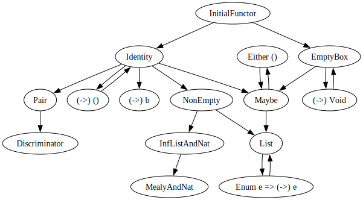

This diagram shows the subfunctor relationships between various Haskell type constructors that have been implemented in this library.

The arrow points to the functor that is the subfunctor. So, Identity is a subfunctor of InitialFunctor, for example.

A subfunctor relationship is an injective natural transformation (a mapping between functors). This library also implements all the associated retractions (i.e. reverse operations).

**NOTE**: The retractions are not necessarily total functions, although we do try to make them total where possible, e.g. by
mapping back values outside the range of the natural transformation to dummy values. Inside the range of the natural transformation,
calling the retraction must "undo" the effect of the natural transformation, i.e. yield the original value.

Everything is in fact a subfunctor of `InitialFunctor` - but this fact is not shown in the diagram because it would be too messy!

For more details on what the node labels mean, check out [the Haskell source code](./src), which in most cases should answer that question.
If not, it should be fairly obvious.

